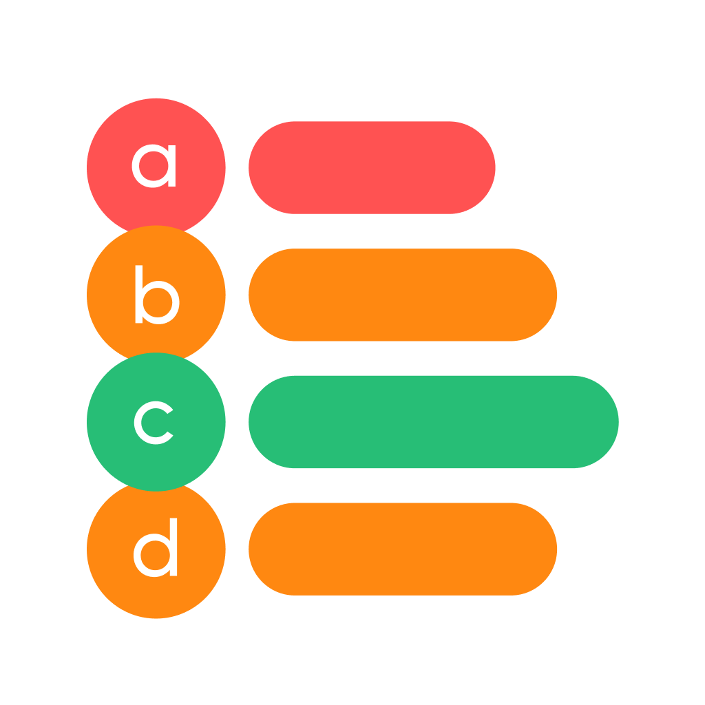
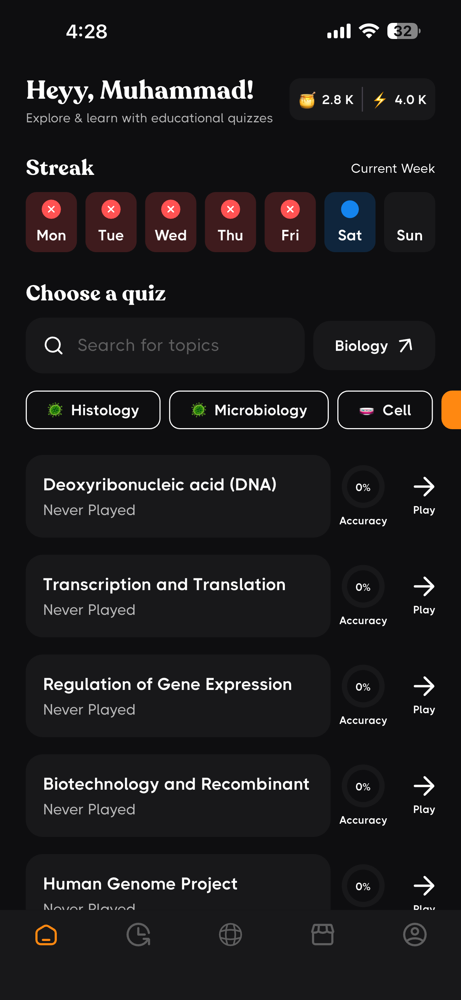
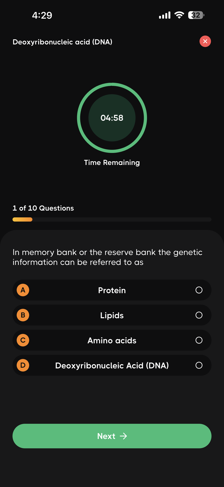
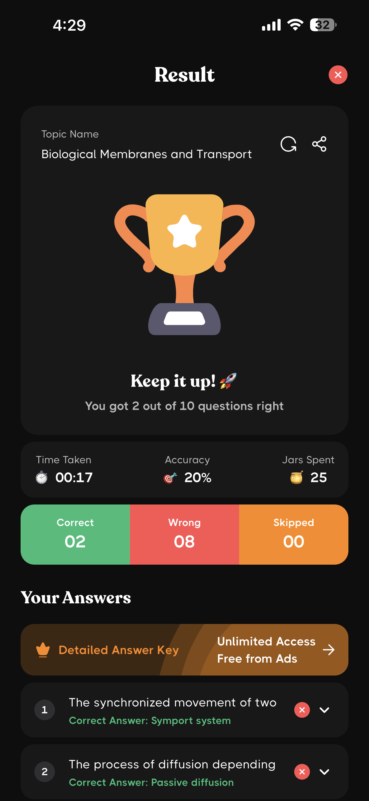
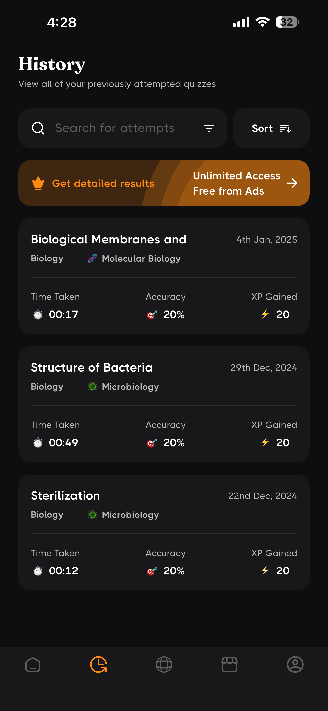
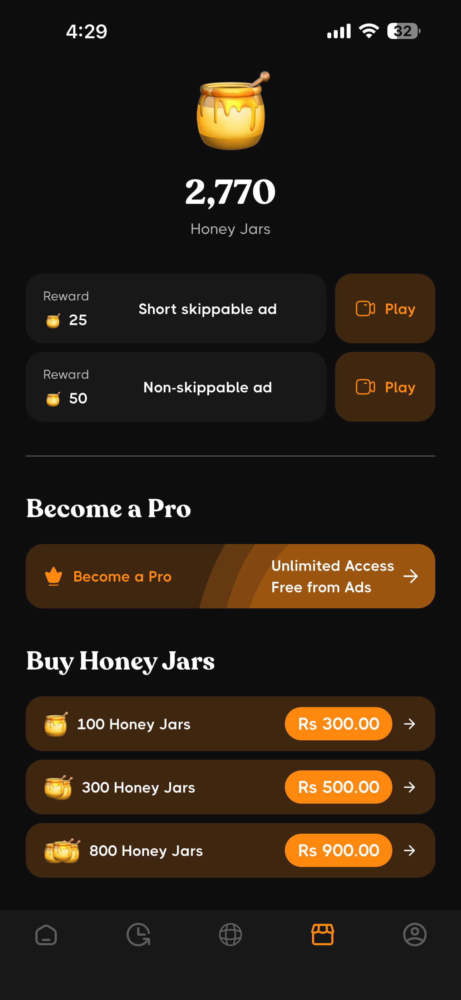

<p align="center">
  
</p>

<h1 align="center">MCQsLearn</h1>

<p align="center">
  <strong>The Ultimate MCQ Learning Platform for Students & Professionals</strong>
</p>

<p align="center">
  <a href="https://apps.apple.com/us/app/mcqslearn-all-in-one-courses/id1596594442">
    
  </a>
  <a href="https://play.google.com/store/apps/details?id=quiz.mcqslearn.allinone&hl=en">
    
  </a>
  
  
</p>

<p align="center">
  
  
  
  
</p>

---

## 📖 Overview

**MCQsLearn** is a comprehensive, production-ready mobile application designed to help students and professionals master subjects through Multiple Choice Questions (MCQs). With 70+ specialized subject apps spanning Science, Engineering, Business, and more, MCQsLearn provides an engaging and effective learning experience.

### 🎯 The Problem

Students and professionals struggle with:

- Finding quality MCQ practice materials for their specific subjects
- Tracking their learning progress across topics
- Staying motivated and engaged while studying
- Accessing community-driven content and study materials

### 💡 The Solution

MCQsLearn provides:

- **70+ Specialized Subject Apps** covering Biology, Chemistry, Physics, Computer Science, Business, Engineering, and more
- **Smart Quiz System** with topics, chapters, and timed practice tests
- **Community Features** for user-generated content sharing
- **Progress Tracking** with detailed history and analytics
- **Gamification** with achievements, badges, and streaks

---

## 👨‍💻 My Role & Contributions

As a **Lead Flutter Developer**, I was responsible for:

### Core Development

- 🏗️ **Architected** the entire Flutter application using feature-based modular architecture
- 📱 **Built** 8+ feature modules from scratch (Quiz, Community, Profile, Shop, etc.)
- 🎮 **Implemented** gamification system with achievements and badges
- 🔄 **Developed** multi-flavor build system for 70+ subject-specific apps

### Technical Challenges Solved

- ⚡ **Performance**: Optimized quiz rendering for smooth 60fps experience
- 🎨 **Multi-Flavor Architecture**: Built scalable system for 70+ app variants from single codebase
- 💳 **Monetization**: Integrated RevenueCat for subscriptions + Google AdMob for ads
- 🔔 **Notifications**: Implemented smart reminder system for study streaks

### Backend & Infrastructure

- ☁️ **Supabase**: Designed database models and Row Level Security policies
- 🔥 **Firebase**: Set up Analytics, Crashlytics, and Performance Monitoring
- 📊 **Analytics**: Comprehensive tracking for user behavior and engagement

---

## 📊 Impact & Results

<p align="center">
  <table>
    <tr>
      <td align="center">
        <h3>25k+</h3>
        <p>Total Downloads</p>
      </td>
      <td align="center">
        <h3>70+</h3>
        <p>Subject Apps</p>
      </td>
      <td align="center">
        <h3>4.5⭐</h3>
        <p>App Store Rating</p>
      </td>
      <td align="center">
        <h3>310k</h3>
        <p>Questions Answered</p>
      </td>
    </tr>
  </table>
</p>

### Key Achievements

- 📈 **20%** increase in user retention after gamification features
- ⚡ **900ms** average quiz question load time
- 🐛 **99.99%** crash-free sessions (Firebase Crashlytics)
- 🌍 **150+** countries with active users

---

## 📸 Screenshots

<p align="center">
  
  
  
  
</p>

<p align="center">
  
  
  
</p>

---

## ✨ Key Features

### 📱 For Students

| Feature                   | Description                                               |
| ------------------------- | --------------------------------------------------------- |
| **Smart Quizzes**         | Topic-based MCQ practice with timers and instant feedback |
| **Progress Tracking**     | Detailed history of all quiz attempts with filters        |
| **Achievements & Badges** | Gamified learning with rewards and milestones             |
| **Dark/Light Mode**       | Comfortable studying in any lighting condition            |
| **Study Reminders**       | Smart notifications to maintain study streaks             |
| **Offline Support**       | Study without internet connection                         |

### 👥 Community Features

| Feature                 | Description                                     |
| ----------------------- | ----------------------------------------------- |
| **User-Generated MCQs** | Create and share single MCQ questions           |
| **Quiz Sets**           | Build and share complete quiz sets              |
| **Flashcards**          | Create and study with digital flashcards        |
| **Polls**               | Engage with community through educational polls |
| **Content Voting**      | Upvote/downvote community content               |

### 🎓 Subject Coverage

| Category             | Subjects                                                                                                |
| -------------------- | ------------------------------------------------------------------------------------------------------- |
| **Biology**          | O-Level, A-Level, 9th, 10th, College, Cell Bio, Molecular Bio, Histology, Microbiology, Zoology, Phylum |
| **Chemistry**        | O-Level, A-Level, 9th, 10th, College Chemistry                                                          |
| **Physics**          | O-Level, A-Level, 9th, 10th, College Physics                                                            |
| **Computer Science** | DBMS, Digital Logic, OS, Networks, Computer Architecture, Semantic Web                                  |
| **Engineering**      | Digital Electronics, Electronic Devices, Electromagnetic Theory, Circuit Analysis                       |
| **Business**         | HRM, Marketing, Financial Management, Business Statistics, Cost Accounting, Project Management          |
| **General**          | Psychology, Sociology, General Knowledge, International Relations                                       |

---

## 🏗️ Architecture

### System Architecture Diagram

```
┌─────────────────────────────────────────────────────────────────────┐
│                       MCQSLEARN ARCHITECTURE                        │
├─────────────────────────────────────────────────────────────────────┤
│                                                                     │
│  ┌──────────────┐     ┌──────────────┐                              │
│  │   Flutter    │     │   Flutter    │                              │
│  │     iOS      │     │   Android    │                              │
│  └──────┬───────┘     └──────┬───────┘                              │
│         │                    │                                      │
│         └────────────────────┼───────────────────────┐              │
│                              │                       │              │
│                    ┌─────────▼─────────┐             │              │
│                    │   GetX State      │             │              │
│                    │   Management      │             │              │
│                    └─────────┬─────────┘             │              │
│                              │                       │              │
│         ┌────────────────────┼───────────────────────┤              │
│         │                    │                       │              │
│  ┌──────▼──────┐      ┌──────▼──────┐     ┌─────────▼─────────┐     │
│  │  Supabase   │      │  Firebase   │     │    RevenueCat     │     │
│  │  Backend    │      │  Services   │     │   Subscriptions   │     │
│  └──────┬──────┘      └──────┬──────┘     └───────────────────┘     │
│         │                    │                                      │
│  ┌──────┴──────────────────────────────────────┐                    │
│  │ Supabase:                                   │                    │
│  │ • PostgreSQL Database                       │                    │
│  │ • Row Level Security (RLS)                  │                    │
│  │ • Realtime Subscriptions                    │                    │
│  │ • Authentication                            │                    │
│  └─────────────────────────────────────────────┘                    │
│         │                                                           │
│  ┌──────┴──────────────────────────────────────┐                    │
│  │ Firebase:                                   │                    │
│  │ • Firebase Analytics                        │                    │
│  │ • Firebase Crashlytics                      │                    │
│  │ • Firebase Performance                      │                    │
│  └─────────────────────────────────────────────┘                    │
│                                                                     │
└─────────────────────────────────────────────────────────────────────┘
```

### Project Structure

```
lib/
├── app/
│   ├── core/                    # Core utilities and shared functionality
│   │   ├── bindings/           # Global GetX bindings
│   │   ├── constants/          # App constants, colors, fonts, routes
│   │   ├── controllers/        # Global controllers (User, Theme, Course)
│   │   ├── extensions/         # Dart extensions
│   │   ├── functions/          # Helper functions
│   │   ├── models/             # Shared data models
│   │   ├── notifications/      # Push notification handlers
│   │   ├── routes/             # App routing configuration
│   │   ├── screens/            # Shared screens (Error, Loading)
│   │   ├── services/           # Core services (AdMob, Supabase, DeepLinks)
│   │   ├── utils/              # Utility classes
│   │   └── widgets/            # Reusable UI components (29+ widgets)
│   │
│   └── features/               # Feature modules (8 modules)
│       ├── authentication/     # 🔐 Login, Register, Social Auth
│       ├── community/          # 👥 UGC: MCQs, Polls, Flashcards, Quiz Sets
│       ├── history/            # 📜 Quiz attempt history & filtering
│       ├── home/               # 🏠 Main navigation & dashboard
│       ├── onboarding/         # 👋 Onboarding & splash screens
│       ├── profile/            # 👤 User profile, achievements, settings
│       ├── quiz/               # 📝 Quiz system, topics, questions
│       └── shop/               # 🛍️ Premium subscriptions & purchases
│
├── main_flavors/               # 70+ flavor entry points
│   ├── main_allinone.dart
│   ├── main_olevelbio.dart
│   ├── main_alevelchem.dart
│   └── ... (70+ more)
│
├── flavor_config.dart          # Flavor configuration
├── injection_handler.dart      # Dependency injection setup
└── main.dart                   # App entry point
```

### Feature Module Pattern

Each feature follows a consistent, scalable structure:

```
feature/
├── bindings/       # GetX dependency injection
├── controllers/    # Business logic (GetX controllers)
├── enums/          # Feature-specific enums
├── models/         # Data models & entities
├── screens/        # UI screens
├── services/       # API/Database services
├── utils/          # Feature utilities
└── widgets/        # Feature-specific widgets
```

---

## 🧩 Technical Challenges & Solutions

### 1. Multi-Flavor Architecture for 70+ Apps

**Challenge**: Build and maintain 70+ subject-specific apps from a single codebase efficiently.

**Solution**: Implemented a robust flavor system:

```dart
// Flavor configuration for each subject app
class AppConfig {
  final String appName;
  final String courseId;
  final String bundleId;
  // Subject-specific configurations
}

// Each flavor has its own entry point
// main_flavors/main_olevelbio.dart
void main() => quizMain(AppConfig(
  appName: 'O-Level Biology',
  courseId: '101101',
  bundleId: 'quiz.quizapp.mcqslearn.olevelbiology',
));
```

**Result**: Single codebase serves 70+ apps with minimal maintenance overhead.

### 2. Offline-First Quiz Experience

**Challenge**: Enable seamless quiz-taking even without internet connectivity.

**Solution**:

- Local storage caching with GetStorage
- Optimistic UI updates
- Background sync when connectivity is restored
- Smart data preloading for topics

### 3. Community Content Moderation

**Challenge**: Manage user-generated content quality across a large user base.

**Solution**:

- Bad words filter integration
- User reporting system
- Content voting mechanism
- Admin review pipeline via Supabase

### 4. Monetization Balance

**Challenge**: Balance free content access with sustainable revenue.

**Solution**:

- Freemium model with RevenueCat subscriptions
- Non-intrusive Google AdMob integration
- Premium features: ad-free, unlimited quizzes, exclusive content

---

## 🛠️ Tech Stack

### Frontend

| Technology    | Purpose                       |
| ------------- | ----------------------------- |
| Flutter 3.16+ | Cross-platform UI framework   |
| GetX          | State management, DI, routing |
| GetStorage    | Local data persistence        |
| Lottie        | Engaging animations           |

### Backend & Database

| Technology           | Purpose                             |
| -------------------- | ----------------------------------- |
| Supabase             | PostgreSQL database, Auth, Realtime |
| Firebase Core        | App initialization                  |
| Firebase Analytics   | User behavior tracking              |
| Firebase Crashlytics | Crash reporting                     |

### Monetization

| Technology        | Purpose                 |
| ----------------- | ----------------------- |
| RevenueCat        | Subscription management |
| Google Mobile Ads | Ad monetization         |
| In-App Review     | User ratings prompt     |

### Authentication

| Technology         | Purpose                       |
| ------------------ | ----------------------------- |
| Supabase Auth      | Email/Password authentication |
| Google Sign-In     | Social login                  |
| Sign in with Apple | iOS social login              |

### Notifications & Engagement

| Technology                  | Purpose                    |
| --------------------------- | -------------------------- |
| Flutter Local Notifications | Study reminders            |
| Showcaseview                | Feature discovery tooltips |
| App Tracking Transparency   | iOS privacy compliance     |

### Content & Media

| Technology    | Purpose                  |
| ------------- | ------------------------ |
| Flutter Quill | Rich text editor for UGC |
| Flutter HTML  | HTML content rendering   |
| Audioplayers  | Sound effects            |

---

## 🚀 Getting Started

### Prerequisites

- Flutter SDK 3.16+ (via FVM recommended)
- Xcode 15+ (iOS development)
- Android Studio (Android development)
- Supabase account
- Firebase project

### Installation

```bash
# 1. Clone the repository
git clone https://github.com/[username]/mcqslearn.git
cd mcqslearn/app

# 2. Install FVM (recommended)
dart pub global activate fvm
fvm install 3.16.9
fvm use 3.16.9

# 3. Install dependencies
fvm flutter pub get

# 4. Set up environment files
cp .env.example .env.dev
cp .env.example .env.prod
# Edit .env files with your API keys

# 5. iOS setup
cd ios && pod install && cd ..

# 6. Run the app (All-in-One flavor)
fvm flutter run --flavor 0 -t "lib/main_flavors/main_allinone.dart"
```

### Build Commands

```bash
# Development - All-in-One
fvm flutter run --flavor 0 -t "lib/main_flavors/main_allinone.dart"

# Production APK
fvm flutter build apk --flavor 0 -t "lib/main_flavors/main_allinone.dart"

# Production App Bundle (Android)
fvm flutter build appbundle --flavor 0 -t "lib/main_flavors/main_allinone.dart"

# Production IPA (iOS)
fvm flutter build ipa --flavor 0 -t "lib/main_flavors/main_allinone.dart"

# Build specific subject (e.g., O-Level Biology)
fvm flutter build appbundle --flavor 101101 -t "lib/main_flavors/main_olevelbio.dart"
```

---

## 🔐 Security & Best Practices

- ✅ **Environment Variables**: Sensitive keys managed via `flutter_dotenv`
- ✅ **Supabase RLS**: Row Level Security for database access control
- ✅ **Input Validation**: Bad words filter, content validation
- ✅ **ProGuard**: Android code obfuscation enabled
- ✅ **Crashlytics**: Real-time crash monitoring and reporting
- ✅ **App Tracking Transparency**: iOS privacy compliance

---

## 🌐 App Flavors

| Category         | Flavor ID       | Subject                             |
| ---------------- | --------------- | ----------------------------------- |
| All-in-One       | 0               | Complete Subject Library            |
| Biology          | 101101 - 101112 | O-Level to College Biology          |
| Chemistry        | 102101 - 102105 | O-Level to College Chemistry        |
| Physics          | 103101 - 103105 | O-Level to College Physics          |
| Business         | 104101 - 104113 | HRM, Marketing, Finance, Statistics |
| Computer Science | 105101 - 105110 | DBMS, Networks, OS, Architecture    |
| Mathematics      | 106105 - 106108 | College Math, Grade 6-8             |
| Geography        | 107101 - 107103 | Grade 6-8 Geography                 |
| Science          | 108101 - 108103 | Grade 6-8 General Science           |
| Engineering      | 201101 - 202105 | Math, Physics, Electronics          |
| General          | 301101 - 301109 | Psychology, Sociology, GK           |

---

## 🎨 Design System

### Typography

- **Recoleta**: Display headings (100-900 weights)
- **THICCCBOI**: Body text (100-900 weights)

### Theme Support

- 🌞 **Light Mode**: Clean, bright interface for daytime study
- 🌙 **Dark Mode**: Eye-friendly dark interface for night study

---

## 📚 Documentation

| Document                                   | Description                 |
| ------------------------------------------ | --------------------------- |
| [Architecture Guide](docs/architecture.md) | System design & patterns    |
| [Flavor Configuration](docs/flavors.md)    | Multi-app flavor setup      |
| [API Documentation](docs/api.md)           | Supabase schema & endpoints |

---

## 🔮 Future Roadmap

- [ ] AI-powered question generation
- [ ] Multiplayer quiz battles
- [ ] Study groups & collaboration
- [ ] Video explanations for questions
- [ ] Spaced repetition algorithm
- [ ] Web app version
- [ ] Offline content downloads

---

## 📬 Contact

**[Your Name]**

- 📧 Email: [your.email@example.com]
- 💼 LinkedIn: [linkedin.com/in/yourprofile]
- 🐙 GitHub: [github.com/yourusername]
- 🌐 Portfolio: [yourportfolio.com]

---

<p align="center">
  <a href="https://apps.apple.com/us/app/mcqslearn-all-in-one-courses/id1596594442">
    
  </a>
  &nbsp;&nbsp;&nbsp;
  <a href="https://play.google.com/store/apps/details?id=quiz.mcqslearn.allinone&hl=en">
    
  </a>
</p>

<p align="center">
  <sub>Built with ❤️ using Flutter</sub>
</p>
